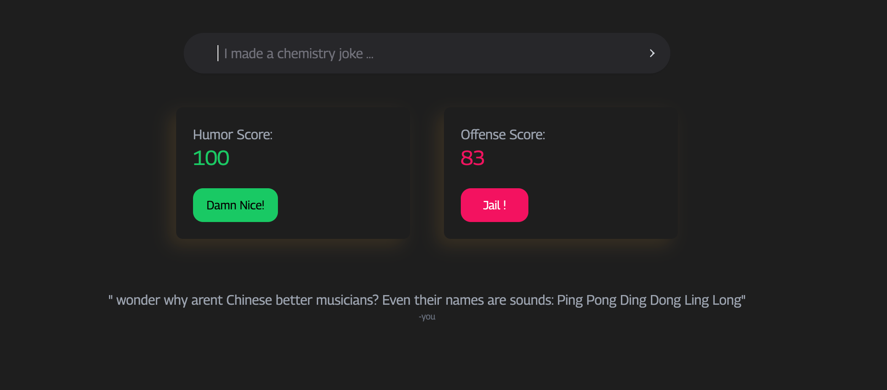

# 🎭 What A Joke

**What A Joke** is a playful web application that evaluates the humor and offense levels of user-submitted jokes. By leveraging advanced NLP (Natural Language Processing) techniques, it delivers scores based on **laughter value** and **offense value**, giving you real-time feedback on how your jokes land!

---

## 🚀 Features

- **Laughter Value**: Gauge how funny your joke is based on crowd-sourced and machine-learned humor patterns.
- **Offense Value**: Detect how offensive your joke might be, ensuring your humor stays light-hearted.
- **Real-Time Scoring**: Get instant feedback as you submit your joke.
- **Simple Interface**: Easy-to-use web interface to quickly check your joke’s scores.
- **NLP-Powered**: Backed by advanced NLP models to provide accurate and unbiased results.

---

## 🛠️ Tech Stack

---

## 🖥️ How It Works

1. **Submit a Joke**: Enter your joke into the text box and hit 'Submit'.
2. **Laughter and Offense Scores**: Our NLP model processes your joke and provides two scores:
   - **Laughter Value**: How funny your joke is.
   - **Offense Value**: How offensive the joke might be.
3. **Get Feedback**: Review your joke's scores instantly on the results page.

---

Made with ❤️ by Avneet Singh
